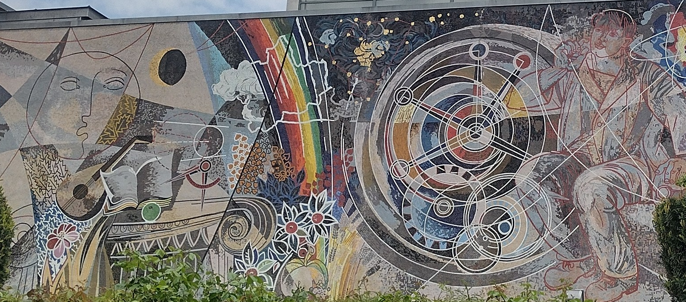

---
# Feel free to add content and custom Front Matter to this file.
# To modify the layout, see https://jekyllrb.com/docs/themes/#overriding-theme-defaults

layout: default
---

# Welcome!

I am Clémence, currently a PhD student at Humboldt University Berlin. As part of the [Romanczuk Lab](http://lab.romanczuk.de/) and the [Barfuss Lab](https://barfusslab.github.io/), I investigate the impact of heuristics on collective learning dynamics. To do so, I use tools from *reinforcement learning*, *agent-based modeling*, *complex systems*, and *game theory*. 

My CV is available upon request. Feel very welcome to contact me at *myfirstname* dot *mylastname* at *hu-berlin.de*
